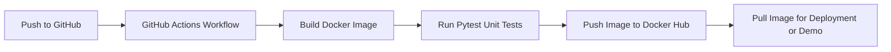
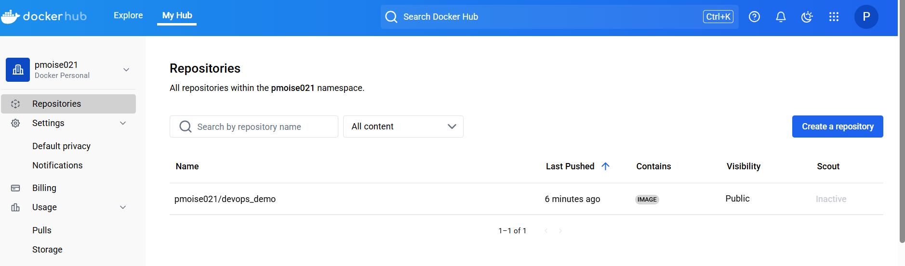

## 🚀 CI/CD Pipeline with Docker & GitHub Actions

This project demonstrates a **DevOps automation pipeline** that builds, tests, and deploys a containerized Python application using **GitHub Actions** and **Docker Hub**.

### 🧩 Key Features

* **Containerized Microservice** built with Python and Flask
* **Automated CI/CD Pipeline** via GitHub Actions (build, test, deploy)
* **Integrated Unit Testing** using Pytest
* **Continuous Deployment** — container image automatically pushed to Docker Hub
* **Shell-based Setup Automation** with `setup.sh`

### 🧱 Architecture Overview



---

### 🐳 Docker Hub Integration

This CI/CD workflow automatically builds and publishes Docker images.

```
Repository: pmoise021/devops_demo
Visibility: Public
```



---

### 🧠 Tech Stack

* **Python / Flask**
* **Docker / Docker Hub**
* **GitHub Actions**
* **Pytest**
* **Shell scripting**

## Docker Image on Docker Hub

Here is the Docker image that has been published to Docker Hub:


